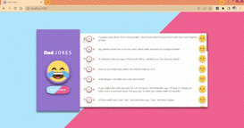

# Dad Jokes App

## Description

This is a simple app that displays jokes. It is possible to evaluate the jokes by upvoting or downvoting them and also get new jokes. Here's a preview of what it looks like:

## How to run it:

After dowloading and unziping the files in your machine, open a command window inside of the dad-jokes-app directory folder and run:

### `npm install`

Wait for the operation to complete and run:

### `npm start`

A few seconds later, your browser should open running the application. If this doesn't occur, try opening the browser by yourself and going to [localhost:3000](https://localhost:3000)